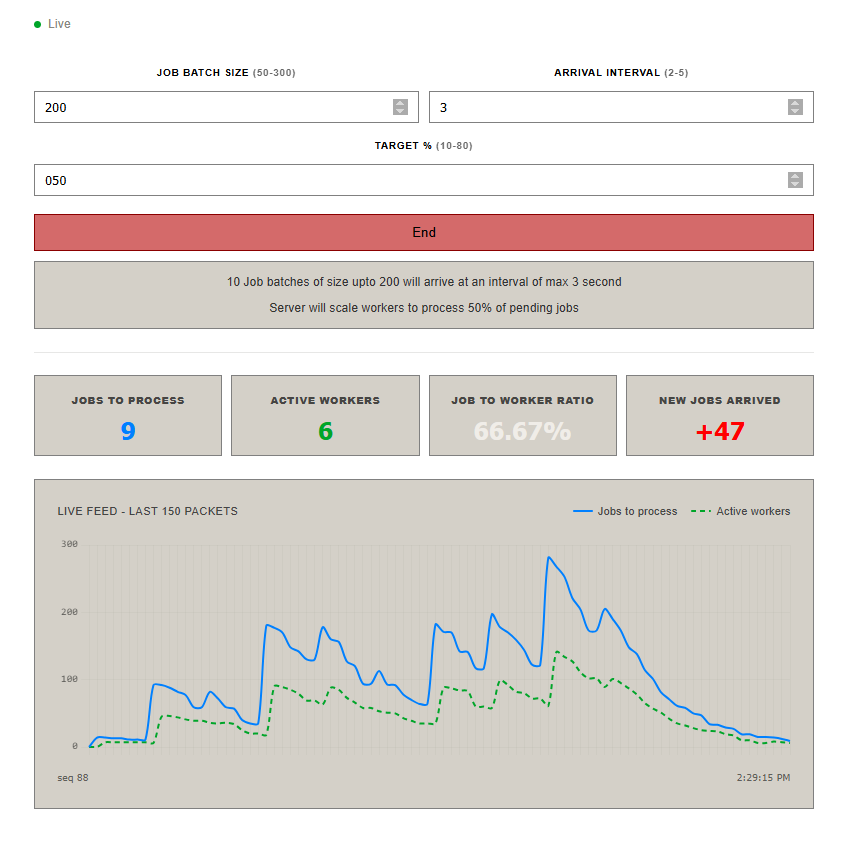

# Async Scale

Asynchronous job processing simulator that dynamically scales worker instances based on queue workload and live streams telemetry data.



# Core
- Entry point - ***src.simulation.start.py***
- Add new jobs to database - ***src.simulation.seed_data.py***
- Upscale/downscale worker instances - ***src.simulation.scaler.py***
- Worker instance - ***src.simulation.worker.py***

# Endpoints

>### wb /connect/{client_id}
- To establish websocket connection and recieve telemetry packets
- Response shape
```python
class StatsPayload(BaseModel):
    jobs_to_process: int | None = None
    active_workers: int | None = None
    jobs_done: int | None = None
    new_jobs: int | None = None
```

>### post /data
- To start simulation
- Request shape:
```python
class SimPayload(BaseModel):
    client_id: str
    size: int = Field(gt=49, le=300)
    interval: int = Field(gt=1, le=5)
    target: int = Field(gt=9, le=80)
```


